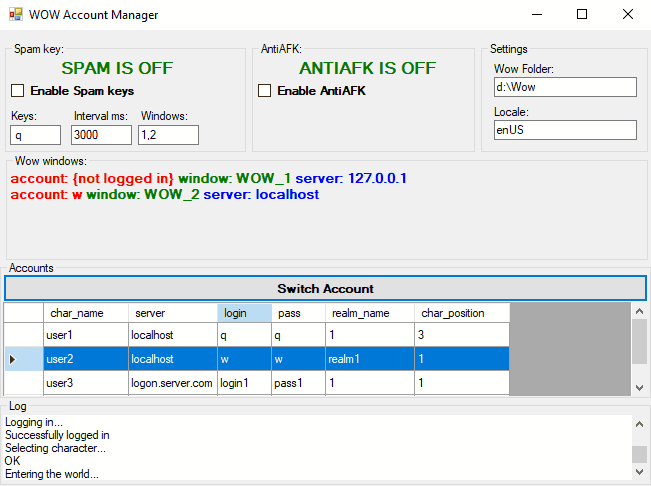
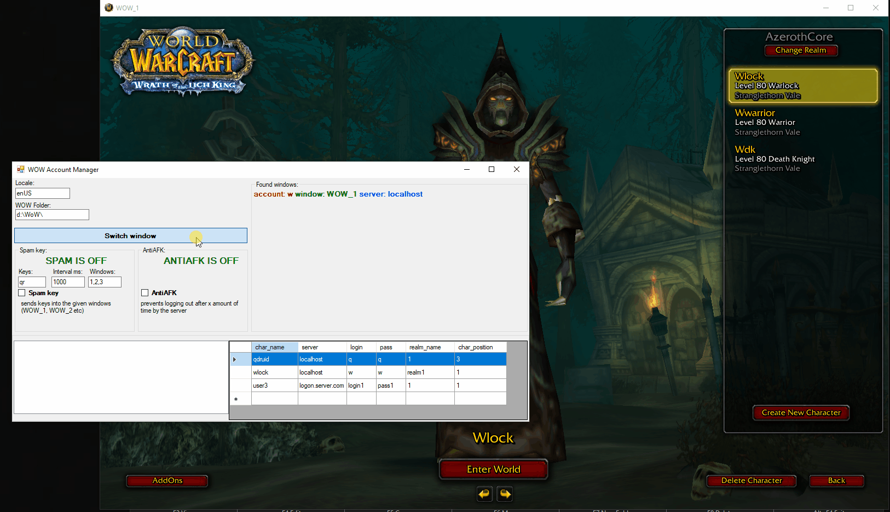
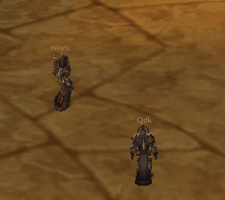

# Wow Account Manager

This is **C\# Windows Forms** application designed to manage multiple [World of Warcraft (WoW)](https://www.google.com/search?q=World+of+Warcraft) accounts simultaneously. It automates the login process, maintains active sessions via anti-AFK mechanics, and provides a multi-threaded key-spamming utility.  

  

## 🚀 Key Features
* **Automated Account Management**: Allows users to select an account from a stored list for instant login or seamless switching between active game windows.  

*Note: Visual demonstrations were captured in a controlled environment for the purpose of validating system stability and latency under real-world conditions.*

* **Dynamic Realm Handling**: Automatically detects if the current game client matches the required realm; if not, it updates the realm file and launches a fresh client instance.  
* **Intelligent Login & Character Selection**: Reads game states (login screen, character selection) to automatically input credentials and enter the game world with a pre-selected character.  
* **Advanced Anti-AFK System**: Keeps multiple characters online by simulating randomized movement and jumping patterns, preventing inactivity-based disconnections.  

* **Multi-Threaded Key Spammer**: Enables users to send custom key combinations to specific game windows at user-defined intervals.  

## ⚙️ How It Works
* **P/Invoke & Win32 API**: Leverages `user32.dll` and `kernel32.dll` to perform low-level window management and simulate keyboard input directly to game clients.  
* **High-Concurrency Architecture**: Spawns independent threads for each spam task to ensure non-blocking performance across multiple game instances.  
* **Thread Safety & Synchronization**: Employs **atomic read-modify-write** operations on shared variables to maintain state integrity and prevent race conditions in a multi-threaded environment.  
* **Data Persistence**: Uses a `DataSet` backed by an **XML file system** for lightweight, portable storage of account credentials and configuration data. 

## 🏁 Getting Started
1. **Clone the Repository**: Use the GitHub Desktop client or run `git clone https://github.com/nick-cdev/WowAccountManager`.  
2. **Prerequisites**: Ensure you have the .NET Framework installed.  
3. **Build**: Open the `.sln` file in Visual Studio and build the solution to generate the executable. 

> ## ⚠️ Legal Disclaimer
> 
> **This tool is for educational and research purposes only.** 
>
>### Research Methodology
> Visual demonstrations were captured in a controlled environment for the purpose of validating system stability and latency under real-world conditions. 
> ### Use at Your Own Risk
> The author (and any contributors) are NOT responsible for:
> *   **Account Actions:** Any bans, suspensions, or penalties applied to your accounts by game developers or anti-cheat systems (e.g., VAC, BattlEye, Easy Anti-Cheat).
> *   **System Damage:** Any data loss, hardware failure, or system instability caused by the use of this software.
> *   **Legal Consequences:** Any misuse of this tool that violates local laws or third-party Terms of Service.
> 
> ### License
> This project is licensed under the **GNU Affero General Public License v3.0 (AGPL-3.0)**. 
> THE SOFTWARE IS PROVIDED "AS IS", WITHOUT WARRANTY OF ANY KIND, EXPRESS OR IMPLIED. 
> 
> ### Third-Party Notices
> This project incorporates bundled code from third parties. For details and full license texts, please see the [THIRD-PARTY-NOTICES](THIRD-PARTY-NOTICES) file.